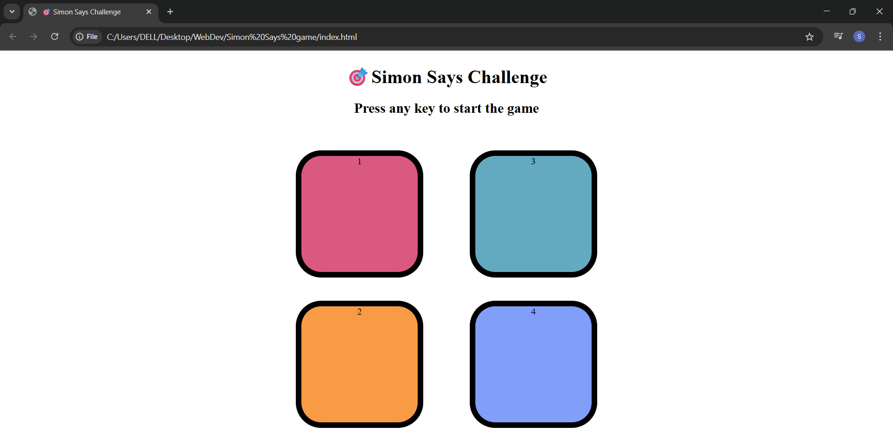

# 🎯 Simon Says Challenge
A fun and interactive memory game built using **HTML**, **CSS**, and **JavaScript**. This project replicates the classic “Simon Says” game where the player must remember and repeat an increasingly complex pattern of colors.

## 🌟 Features

- 🔢 Random color sequence generation
- 👆 User input detection
- 🎯 Game restart on incorrect sequence

## 🛠️ Built With

- HTML5
- CSS3
- JavaScript (DOM manipulation)

## 🚀 Live Demo

🌐 [Play Simon Says Challenge](https://codebyswatii.github.io/-Simon-Says-Challenge/)  
*(Replace with your actual GitHub Pages URL)*

## 📸 Screenshots

## 🧠 How to Play

1. Press any key to start.
2. Watch the color sequence flash.
3. Click the buttons in the same order.
4. The sequence increases with each level.
5. One mistake and the game resets!

## 📩 Feedback

If you have suggestions or feedback, feel free to reach out or open an issue.

---

👩‍💻 Built with 💙 by [Swati Thakur](https://github.com/codebyswatii)
